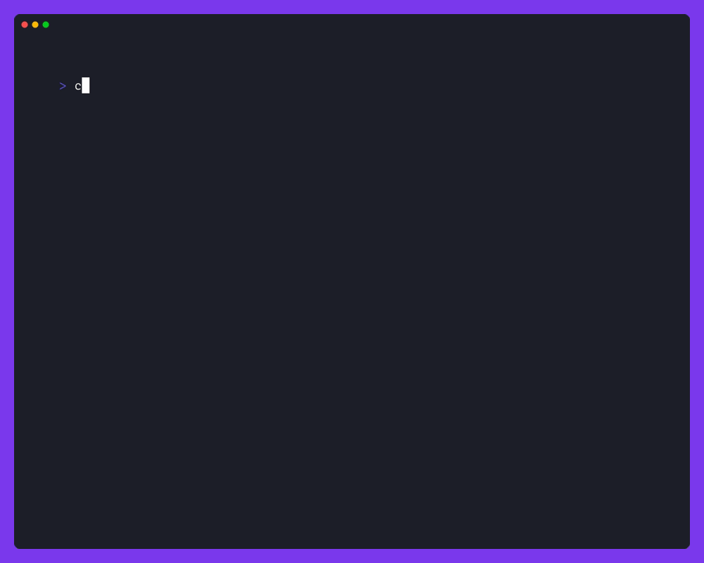

# C6 CLI

[](https://pkg.go.dev/github.com/c6dk/c6-cli)
[](https://github.com/c6dk/c6-cli/actions/workflows/ci.yml)

A command line interface for [C6](https://www.c6.dk).

## Installation

```shell
go install github.com/c6dk/c6-cli/cmd/c6@latest
```

## Usage



Made in 🇩🇰 by [maragu](https://www.maragu.dk/).
